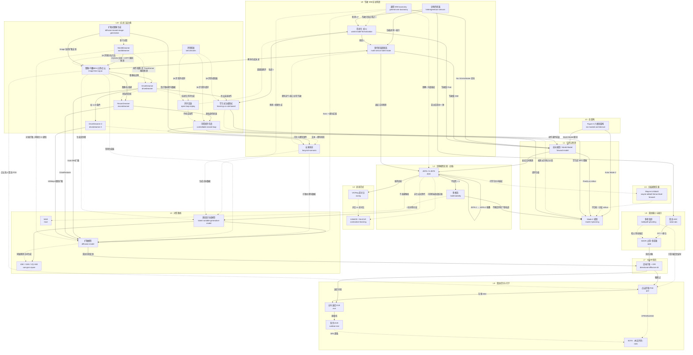

# 概念总览 · 关系图

两条来源主线：

- LeCun, *A Path Towards Autonomous Machine Intelligence* (2022) → L0–L5
- Wang et al., *SDDiff* (arXiv:2506.16936v1) → L6–L8
- Feng et al., *A Survey of World Models for Autonomous Driving* (arXiv:2501.11260v4) → L9

节点对应 `notes/` 下各条笔记；**实线**=组成/实现，**虚线**=对照或历史先驱。

## 图例

| 线型 | 含义 |
|------|------|
| 实线 `-->` | 组成、实现、推荐路径 |
| 虚线 `-.->` | 对照组、历史先驱、可选但不主推 |

## 分层阅读顺序（建议）

**JEPA 线**

1. **总架构** → [six-module-architecture.md](six-module-architecture.md)
2. **世界模型核心** → [forward-model.md](forward-model.md) → [jepa.md](jepa.md)
3. **怎么训练** → [vicreg.md](vicreg.md)（对照 [contrastive-learning.md](contrastive-learning.md)）
4. **多模态与规划** → [multimodality.md](multimodality.md) → [mode-2-planning.md](mode-2-planning.md)
5. **为何不用生成式** → [latent-variable-generative-model.md](latent-variable-generative-model.md) / [vae-gan-vqvae.md](vae-gan-vqvae.md) / [diffusion-model.md](diffusion-model.md) / [mae.md](mae.md)
6. **分层先驱** → [wayne-abbott-hierarchical-forward.md](wayne-abbott-hierarchical-forward.md)

**SDDiff 雷达线**

1. **输入** → [radar-adc.md](radar-adc.md) → [sddr.md](sddr.md)
2. **干扰** → [multipath-ghosting.md](multipath-ghosting.md)
3. **方法** → [directional-diffusion-idr.md](directional-diffusion-idr.md)
4. **任务** → [pce.md](pce.md) → [eve.md](eve.md) → [outdoor-eve.md](outdoor-eve.md)
5. **怎么读表** → [sota.md](sota.md)

**驾驶 WM 综述（Feng et al.）**

1. **通用对照** → [general-wm-taxonomy.md](general-wm-taxonomy.md)（Ding 理解/预测；Zhu 视频/驾驶/智能体）
2. **形式化** → [world-model-formalization.md](world-model-formalization.md)
3. **输入与编码** → [heterogeneous-sensors.md](heterogeneous-sensors.md) → [multi-sensor-latent-state.md](multi-sensor-latent-state.md)
4. **未来怎么画** → [image-bev-og-pc.md](image-bev-og-pc.md)（图像轨：[drivedreamer.md](drivedreamer.md) 生成；[drivedreamer-2.md](drivedreamer-2.md) 文本定制；[recondreamer.md](recondreamer.md) 新轨迹重建；[worlddreamer.md](worlddreamer.md) Transformer 掩码预测走通用世界；[diffusion-based-image-generation.md](diffusion-based-image-generation.md) 综述 §3.1.1 扩散支线谱系）
5. **怎么评** → [benchmarks.md](benchmarks.md)（综述 §6：CarlaSC/nuScenes/Occ3D/OpenScene 平台 + 4D 生成/点云/占用/规划 四类表）
5. **轨迹怎么出** → [learning-vs-rule-based.md](learning-vs-rule-based.md)
6. **怎么评交互** → [open-loop-replay.md](open-loop-replay.md) → [controllable-closed-loop.md](controllable-closed-loop.md)
7. **为何要想象** → [long-tail-scenario.md](long-tail-scenario.md)

## 三条主轴（一句话）

| 主轴 | 节点链 |
|------|--------|
| **架构（JEPA）** | 六模块 → 前向模型 → JEPA → Mode-2 规划 |
| **训练（JEPA）** | JEPA ← VICReg；对比 InfoNCE/MAE 为对照；扩散/VAE 为观测空间生成对照 |
| **雷达感知（SDDiff）** | ADC → SDDR → 定向扩散+IDR → PCE ↔ EVE；鬼影为干扰，SOTA 为尺子 |
| **驾驶 WM 用语（综述）** | 通用 taxonomy（理解/预测或视频/驾驶/智能体）对照驾驶三层；形式化 $`z,\tau`$ ← 异构传感器压成潜状态；$`z`$ 走图像/鸟瞰 BEV/OG/PC，$`\tau`$ 走规则或学习；评测从开环回放到可控闭环 |

## 笔记索引

| 笔记 | 一句话 |
|------|--------|
| [six-module-architecture](six-module-architecture.md) | 可微分六模块 + Mode-1/2 |
| [forward-model](forward-model.md) | $`s_{t+1}=\mathrm{Pred}(s_t,a_t)`$ |
| [jepa](jepa.md) | 表征空间非生成式预测 + H-JEPA |
| [multimodality](multimodality.md) | 一对多未来：不变性 + $`z`$ |
| [vicreg](vicreg.md) | 非对比防 collapse |
| [contrastive-learning](contrastive-learning.md) | InfoNCE/SimCLR 对照 |
| [mode-2-planning](mode-2-planning.md) | 世界模型内 MPC |
| [latent-variable-generative-model](latent-variable-generative-model.md) | $`z`$ 参数化相容 $`y`$ 集合 |
| [vae-gan-vqvae](vae-gan-vqvae.md) | 像素空间生成式多模态 |
| [diffusion-model](diffusion-model.md) | 逐步去噪采样；驾驶综述里的主力生成器 |
| [mae](mae.md) | mask 重建像素（对比式） |
| [wayne-abbott-hierarchical-forward](wayne-abbott-hierarchical-forward.md) | 多层前向模型分层控制先驱 |
| [radar-adc](radar-adc.md) | 原始采样；SDDiff 的输入，不是 CFAR 点 |
| [sddr](sddr.md) | 极性占用 + 多普勒，PCE/EVE 的共同表示 |
| [directional-diffusion-idr](directional-diffusion-idr.md) | 雷达先验定向扩散 + 多普勒一致性精炼 |
| [pce](pce.md) | 低层抽点；与 EVE 互惠 |
| [eve](eve.md) | 高层估自车速度；吃纯化后的点/表示 |
| [outdoor-eve](outdoor-eve.md) | 开阔地更难；文称相对 SOTA +59% |
| [sota](sota.md) | 本文选定的 PCE/EVE 基线尺子 |
| [multipath-ghosting](multipath-ghosting.md) | 多径假占用；只靠强度会误导 PCE |
| [heterogeneous-sensors](heterogeneous-sensors.md) | 相机/LiDAR/雷达等收进同一环境表示 |
| [multi-sensor-latent-state](multi-sensor-latent-state.md) | 多传感器压缩成可前滚的潜状态 |
| [long-tail-scenario](long-tail-scenario.md) | 稀有危险情形；生成/排练补数据 |
| [general-wm-taxonomy](general-wm-taxonomy.md) | 通用刀：Ding 理解/预测；Zhu 视频/驾驶/智能体 |
| [world-model-formalization](world-model-formalization.md) | $`\bm{w}(I,P)\to(z,\tau)`$ |
| [image-bev-og-pc](image-bev-og-pc.md) | 透视图像 / 鸟瞰图 BEV / 占用 / 点云 |
| [drivedreamer](drivedreamer.md) | 实路扩散：条件生成驾驶视频 + 开环动作 |
| [drivedreamer-2](drivedreamer-2.md) | LLM 把文本变成轨迹+地图，再扩散出多视角视频 |
| [recondreamer](recondreamer.md) | 在线修复新轨迹渲染，服务闭环仿真 |
| [worlddreamer](worlddreamer.md) | VQGAN+STPT 掩码预测 token，Transformer 路线通用世界视频 |
| [diffusion-based-image-generation](diffusion-based-image-generation.md) | 综述 §3.1.1 图像轨的扩散支线：潜在扩散+多模态条件 |
| [benchmarks](benchmarks.md) | 综述 §6 评测：5 平台 + 4D 生成/点云/占用/规划 四类任务表 |
| [learning-vs-rule-based](learning-vs-rule-based.md) | 轨迹：规则可审计 vs 学习能扛交互 |
| [open-loop-replay](open-loop-replay.md) | 重放既定未来，动作不改下一观测 |
| [controllable-closed-loop](controllable-closed-loop.md) | 动作改未来，且可编辑/注入长尾 |

> GitHub 可直接渲染上方 Mermaid。本地若看不到图，用 VS Code Mermaid 插件或 Obsidian。
