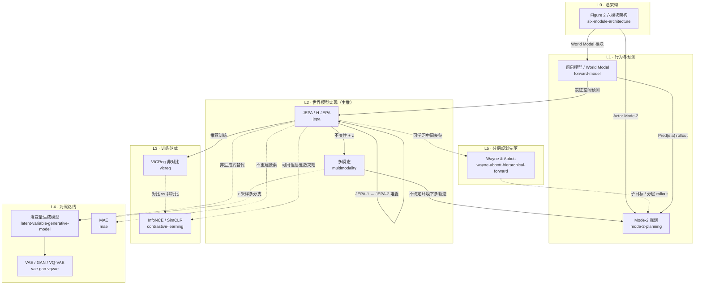

# 概念总览 · 关系图

来源主线：LeCun, *A Path Towards Autonomous Machine Intelligence* (2022)  
节点对应 `notes/` 下各条笔记；**实线**=组成/实现，**虚线**=对照或历史先驱。

## 图例

| 线型 | 含义 |
|------|------|
| 实线 `-->` | 组成、实现、推荐路径 |
| 虚线 `-.->` | 对照组、历史先驱、可选但不主推 |

## 分层阅读顺序（建议）

1. **总架构** → [six-module-architecture.md](six-module-architecture.md)
2. **世界模型核心** → [forward-model.md](forward-model.md) → [jepa.md](jepa.md)
3. **怎么训练** → [vicreg.md](vicreg.md)（对照 [contrastive-learning.md](contrastive-learning.md)）
4. **多模态与规划** → [multimodality.md](multimodality.md) → [mode-2-planning.md](mode-2-planning.md)
5. **为何不用生成式** → [latent-variable-generative-model.md](latent-variable-generative-model.md) / [vae-gan-vqvae.md](vae-gan-vqvae.md) / [mae.md](mae.md)
6. **分层先驱** → [wayne-abbott-hierarchical-forward.md](wayne-abbott-hierarchical-forward.md)

## 三条主轴（一句话）

| 主轴 | 节点链 |
|------|--------|
| **架构** | 六模块 → 前向模型 → JEPA → Mode-2 规划 |
| **训练** | JEPA ← VICReg；对比 InfoNCE/MAE 为对照 |
| **多模态** | 多模态 ← JEPA + z；生成式 latent 为对照 |

## 笔记索引

| 笔记 | 一句话 |
|------|--------|
| [six-module-architecture](six-module-architecture.md) | 可微分六模块 + Mode-1/2 |
| [forward-model](forward-model.md) | $`s_{t+1}=\mathrm{Pred}(s_t,a_t)`$ |
| [jepa](jepa.md) | 表征空间非生成式预测 + H-JEPA |
| [multimodality](multimodality.md) | 一对多未来：不变性 + $`z`$ |
| [vicreg](vicreg.md) | 非对比防 collapse |
| [contrastive-learning](contrastive-learning.md) | InfoNCE/SimCLR 对照 |
| [mode-2-planning](mode-2-planning.md) | 世界模型内 MPC |
| [latent-variable-generative-model](latent-variable-generative-model.md) | $`z`$ 参数化相容 $`y`$ 集合 |
| [vae-gan-vqvae](vae-gan-vqvae.md) | 像素空间生成式多模态 |
| [mae](mae.md) | mask 重建像素（对比式） |
| [wayne-abbott-hierarchical-forward](wayne-abbott-hierarchical-forward.md) | 多层前向模型分层控制先驱 |

> GitHub 可直接渲染上方 Mermaid。本地若看不到图，用 VS Code Mermaid 插件或 Obsidian。
